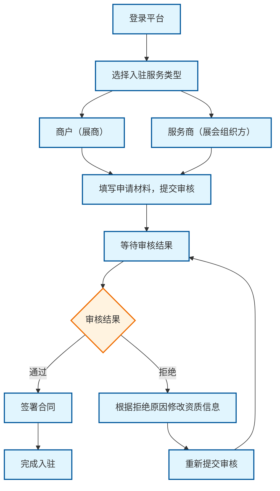
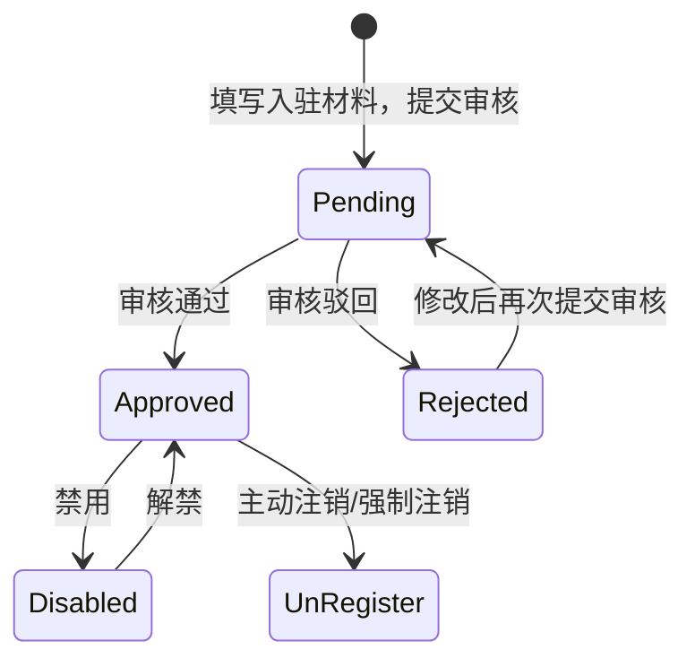
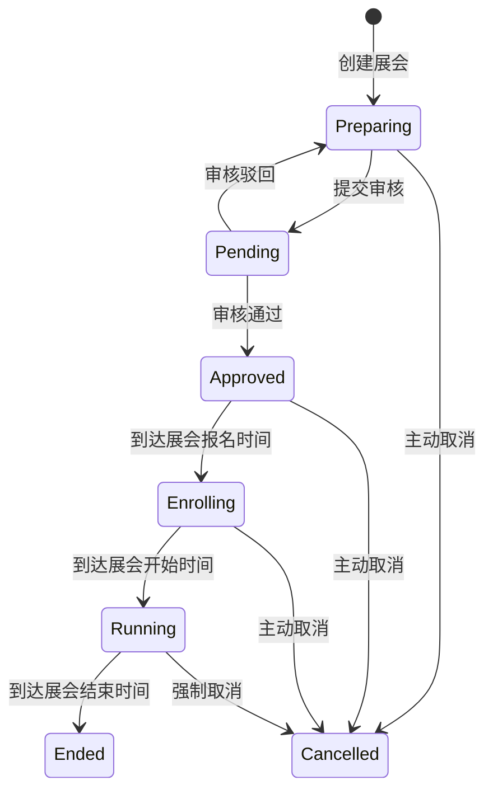

# TODO List
- 入参的参数校验没做，比如长度、格式等。
- Company某些字段，应该是唯一的。
- 系统架构部分，补充服务交互逻辑。最好详细点。

# 项目分析
- ExhibitionService 是展会管理平台的核心服务，负责提供所有展会相关的业务功能.
- 包括移动端用户接口和管理后台接口。系统采用微服务架构，与身份认证服务、消息推送服务、文件服务等独立服务进行交互，提供从展会预告到直播互动的完整业务闭环。

## 业务逻辑
- 登录Web后台后，才可选择入驻服务类型。

### 登录逻辑
- 两种登录方式
  - 手机号注册(后续可选择绑定IUQT账户)。
  - 通过IUQT账户一键登录，后台自动创建关联(登录后需要补充手机号信息)。

### 入驻逻辑


## 业务模型
- <span style="color:red">**展会平台(Platform)**</span>
  - 技术平台提供商，也就是展会的承办方。
- <span style="color:red">**公司(Company)**</span>
  - 维护核心资质
    - 营业执照
    - 统一社会信用代码
    - 法人姓名
    - 法人证件号
    - 法人证件照
- <span style="color:red">**服务提供商(ServiceProvider)**</span>
  - 依赖公司主体存在(平台运营规则)
  - 继承公司基础属性 + 服务提供商专属属性

- <span style="color:red">**商户(Merchant)**</span>
  - 依赖公司主体存在(平台运营规则)
  - 继承公司基础属性 + 扩展商户专属属性
  - <span style="color:red">同一个公司，可以创建多个商户身份</span>。但独立运营。

- <span style="color:red">**展会(Exhibition)**</span>


- <span style="color:red">访客</span>
  - 匿名用户（最低权限）
    - 仅能浏览公开展会信息
  - 注册用户（标准权限）
    - 可收藏展会、预约参观。
  - 认证买家（高级权限）
    - 可联系展商、发起采购询盘
    
# 系统架构

## 服务职责划分

### ExhibitionService (展会服务)
- **核心职责**：提供所有展会相关的业务功能
- **服务范围**：
  - 提供移动端用户接口(首页、搜索、展会、个人中心、消息中心)
  - 提供管理后台接口(IUQT官方、展会公司、商户后台)
  - 展会业务逻辑处理(微服务内权限管理)
  - 直播间管理(创建、删除等，推流由其他服务处理)

### 身份认证服务
- 用户登录、注册
- 基础角色、权限管理
- JWT Token管理

### 消息推送服务
- 实时消息推送
- 消息模板管理
- 推送渠道管理

### 文件服务
- 文件上传下载
- 文件存储管理
- 文件访问控制

### 直播服务
- 直播流推送

# 服务提供商

## 状态流转
- Pending(0): 待审核。
- Approved(1): 审核通过。此时服务商可正常开展业务。
- Rejected(2): 审核驳回。此时服务商可修改资料信息，然后再次提交审核。
- Disabled(3): 禁用。服务商被平台禁用（因违规等），不可开展业务（区别于注销）。
- UnRegisted(4): 注销。服务商主动退出/运营强制退出。


## 数据表设计
```sql
```

## 接口设计
```curl
```

# 商户

## 状态流转
### 状态流转
- Pending(0): 信息已录入，等待平台运营审核。
- Approved(1): 审核通过，此时商户可正常开展业务。
- Rejected(2): 审核驳回，需修改后重新提交审核。
- Disabled(3): 禁用，商户被平台禁用（因违规等），不可开展业务（区别于注销）。
- UnRegisted(4): 注销，商户主动退出，账号永久失效。


## 数据表设计
```sql
```

## 接口设计
```curl

```


# 展会
- 可以由单个服务提供商创建，也可以由多个服务提供商联合创建，也可以有协办商。
- 一个服务提供商可以同时创建多个展会。
- 一个商户可以同时参加多个展会。

## 业务逻辑
### 展会创建
- 创建展会时必须指定所有主办方。

## 状态流转

### 状态定义
- Preparing(0): 筹备中。展会初始状态，进行基础信息配置、展位规划等准备工作。
- Pending(1): 待审核。提交审核后，等待运营人员审核（可退回修改）。
- Approved(2): 已批准。审核通过但是未到报名时间。
- Enrolling(3): 报名中。商家可以申请报名。访客可以预约展会。
- Running(4): 进行中。展会正式开放，参展商和观众可线上互动。
- Ended(5): 已结束。（自动归档数据）
- Cancelled(6): 已取消。主动终止展会（违规行为、运营调整等）


## 数据表设计
```sql
```


## 接口设计
```curl
POST  /api/v1/exhibition-service/exhibitions        # 创建展会(创建时指定所有主办方)


# 展会管理
GET /api/v1/exhibition-service/admin/exhibitions              # 获取展会列表
GET /api/v1/exhibition-service/admin/exhibitions/{id}         # 获取展会详情
POST /api/v1/exhibition-service/admin/exhibitions/{id}/shutdown # 关停展会
POST /api/v1/exhibition-service/admin/exhibitions/{id}/restart # 重启展会

# 商户管理
GET /api/v1/exhibition-service/admin/merchants                # 获取商户列表
GET /api/v1/exhibition-service/admin/merchants/{id}           # 获取商户详情
POST /api/v1/exhibition-service/admin/merchants/{id}/ban      # 封禁商户
POST /api/v1/exhibition-service/admin/merchants/{id}/unban    # 解封商户

# 用户管理
GET /api/v1/exhibition-service/admin/users                    # 获取用户列表
POST /api/v1/exhibition-service/admin/users/{id}/ban          # 封禁用户
POST /api/v1/exhibition-service/admin/users/{id}/unban        # 解封用户
DELETE /api/v1/exhibition-service/admin/users/{id}            # 删除用户

# 申请审核
GET /api/v1/exhibition-service/admin/applications             # 获取申请列表
POST /api/v1/exhibition-service/admin/applications/{id}/approve # 审核通过
POST /api/v1/exhibition-service/admin/applications/{id}/reject # 审核驳回
```


# 与独立服务交互
```
GET /api/v1/exhibition-service/admin/users/{id}/auth-info     # 获取用户认证信息 (调用AuthService)
POST /api/v1/exhibition-service/admin/notifications/send       # 发送管理通知 (调用NotificationService)
GET /api/v1/exhibition-service/admin/files/{id}                # 获取审核文件 (调用FileService)
```

#### 2. 展会公司后台模块

##### 功能特性
- **展会管理**
- **商户管理**
- **人员管理**
- **消息中心**

##### ExhibitionService 接口
```
# 展会管理
GET /api/v1/exhibition-service/company/exhibitions            # 获取展会列表
POST /api/v1/exhibition-service/company/exhibitions           # 创建展会
PUT /api/v1/exhibition-service/company/exhibitions/{id}       # 更新展会
GET /api/v1/exhibition-service/company/exhibitions/{id}/stats # 获取展会统计

# 商户管理
GET /api/v1/exhibition-service/company/merchants              # 获取商户列表
POST /api/v1/exhibition-service/company/merchants/{id}/approve # 审核商户申请
POST /api/v1/exhibition-service/company/merchants/{id}/ban    # 封禁商户
POST /api/v1/exhibition-service/company/merchants/{id}/unban  # 解封商户

# 直播管理
GET /api/v1/exhibition-service/company/live-streams           # 获取直播列表
POST /api/v1/exhibition-service/company/live-streams/{id}/control # 直播控制
GET /api/v1/exhibition-service/company/live-streams/{id}/stats # 获取直播统计

# 人员管理
GET /api/v1/exhibition-service/company/users                  # 获取用户列表
POST /api/v1/exhibition-service/company/users                 # 添加用户
PUT /api/v1/exhibition-service/company/users/{id}/permissions # 设置用户权限
DELETE /api/v1/exhibition-service/company/users/{id}          # 删除用户
```

##### 与独立服务交互
```
POST /api/v1/exhibition-service/company/exhibitions/{id}/files # 上传展会文件 (调用FileService)
POST /api/v1/exhibition-service/company/notifications/send     # 发送公司通知 (调用NotificationService)
GET /api/v1/exhibition-service/company/users/{id}/auth-check   # 验证用户权限 (调用AuthService)
```

#### 3. 商户后台模块

##### 功能特性
- **展会参与管理**
- **直播管理**
- **商户信息管理**
- **人员管理**

##### ExhibitionService 接口
```
# 展会参与
GET /api/v1/exhibition-service/merchant/exhibitions           # 获取参与的展会
POST /api/v1/exhibition-service/merchant/exhibitions/{id}/apply # 申请参与展会
POST /api/v1/exhibition-service/merchant/exhibitions/{id}/exit # 退出展会

# 直播管理
GET /api/v1/exhibition-service/merchant/live-streams          # 获取直播列表
POST /api/v1/exhibition-service/merchant/live-streams         # 创建直播
PUT /api/v1/exhibition-service/merchant/live-streams/{id}     # 更新直播信息
POST /api/v1/exhibition-service/merchant/live-streams/{id}/start # 开始直播
POST /api/v1/exhibition-service/merchant/live-streams/{id}/stop # 结束直播
GET /api/v1/exhibition-service/merchant/live-streams/{id}/stats # 获取直播统计

# 商户信息
GET /api/v1/exhibition-service/merchant/profile               # 获取商户信息
PUT /api/v1/exhibition-service/merchant/profile               # 更新商户信息
POST /api/v1/exhibition-service/merchant/profile/submit       # 提交审核

# 人员管理
GET /api/v1/exhibition-service/merchant/users                 # 获取用户列表
POST /api/v1/exhibition-service/merchant/users                # 添加用户
PUT /api/v1/exhibition-service/merchant/users/{id}/permissions # 设置用户权限
```

##### 与独立服务交互
```
POST /api/v1/exhibition-service/merchant/profile/files        # 上传商户文件 (调用FileService)
POST /api/v1/exhibition-service/merchant/notifications/send   # 发送商户通知 (调用NotificationService)
GET /api/v1/exhibition-service/merchant/users/{id}/auth-verify # 验证用户身份 (调用AuthService)
```

## 🔧 ExhibitionService 核心功能模块

### 1. 直播系统

##### 功能特性
- **实时直播**
- **弹幕系统**
- **连麦功能**
- **数据统计**

##### ExhibitionService 接口
```
# 直播控制
POST /api/v1/exhibition-service/live/start                    # 开始直播
POST /api/v1/exhibition-service/live/stop                     # 结束直播
GET /api/v1/exhibition-service/live/{id}/status               # 获取直播状态

# 互动功能
POST /api/v1/exhibition-service/live/{id}/like                # 点赞
POST /api/v1/exhibition-service/live/{id}/comment             # 发送弹幕
GET /api/v1/exhibition-service/live/{id}/comments             # 获取弹幕列表
POST /api/v1/exhibition-service/live/{id}/connect             # 连麦申请
POST /api/v1/exhibition-service/live/{id}/disconnect          # 断开连麦

# 数据统计
GET /api/v1/exhibition-service/live/{id}/viewers              # 获取观看人数
GET /api/v1/exhibition-service/live/{id}/likes                # 获取点赞数
GET /api/v1/exhibition-service/live/{id}/comments-count       # 获取弹幕数
GET /api/v1/exhibition-service/live/{id}/shares               # 获取分享数
```

##### 与独立服务交互
```
POST /api/v1/exhibition-service/live/{id}/notifications       # 发送直播通知 (调用NotificationService)
GET /api/v1/exhibition-service/live/{id}/stream-url           # 获取直播流地址 (调用FileService)
```

### 2. 审核系统

##### 功能特性
- **入驻审核**
- **展会申请审核**
- **内容审核**

##### ExhibitionService 接口
```
# 申请管理
GET /api/v1/exhibition-service/applications                   # 获取申请列表
POST /api/v1/exhibition-service/applications                  # 提交申请
GET /api/v1/exhibition-service/applications/{id}              # 获取申请详情
PUT /api/v1/exhibition-service/applications/{id}              # 更新申请

# 审核流程
POST /api/v1/exhibition-service/applications/{id}/approve     # 审核通过
POST /api/v1/exhibition-service/applications/{id}/reject      # 审核驳回
GET /api/v1/exhibition-service/applications/{id}/history      # 获取审核历史
```

##### 与独立服务交互
```
GET /api/v1/exhibition-service/applications/{id}/files        # 获取申请文件 (调用FileService)
POST /api/v1/exhibition-service/applications/{id}/notify      # 发送审核通知 (调用NotificationService)
GET /api/v1/exhibition-service/applications/{id}/auth-check   # 验证申请人身份 (调用AuthService)
```

### 3. 消息推送系统

##### 功能特性
- **实时通知**
- **消息分类**
- **推送管理**

##### ExhibitionService 接口
```
# 消息管理
GET /api/v1/exhibition-service/notifications/list              # 获取消息列表
POST /api/v1/exhibition-service/notifications/send             # 发送通知
GET /api/v1/exhibition-service/notifications/templates         # 获取推送模板
POST /api/v1/exhibition-service/notifications/subscribe        # 订阅通知
POST /api/v1/exhibition-service/notifications/unsubscribe     # 取消订阅
```

##### 与独立服务交互
```
POST /api/v1/exhibition-service/notifications/push             # 推送消息 (调用NotificationService)
GET /api/v1/exhibition-service/notifications/channels          # 获取推送渠道 (调用NotificationService)
```

### 4. 文件管理系统

##### 功能特性
- **文件上传**
- **文件存储**
- **文件管理**

##### ExhibitionService 接口
```
# 文件管理
GET /api/v1/exhibition-service/files/list                     # 获取文件列表
GET /api/v1/exhibition-service/files/{id}                     # 获取文件信息
DELETE /api/v1/exhibition-service/files/{id}                  # 删除文件
```

##### 与独立服务交互
```
POST /api/v1/exhibition-service/files/upload                  # 上传文件 (调用FileService)
GET /api/v1/exhibition-service/files/{id}/download            # 下载文件 (调用FileService)
GET /api/v1/exhibition-service/files/{id}/preview             # 预览文件 (调用FileService)
```

## 🌐 多语言支持

##### 功能特性
- **双语切换**：本国语言 + 英语
- **动态语言包**
- **用户语言偏好**

##### ExhibitionService 接口
```
GET /api/v1/exhibition-service/i18n/languages                 # 获取支持的语言列表
GET /api/v1/exhibition-service/i18n/translations              # 获取翻译内容
PUT /api/v1/exhibition-service/user/language                  # 设置用户语言偏好
```

## 🔒 权限管理

##### 功能特性
- **角色权限**
- **功能权限**
- **数据权限**

##### ExhibitionService 接口
```
GET /api/v1/exhibition-service/permissions/roles              # 获取角色列表
GET /api/v1/exhibition-service/permissions/{role}/functions   # 获取角色功能权限
PUT /api/v1/exhibition-service/permissions/{role}/functions   # 设置角色功能权限
GET /api/v1/exhibition-service/user/permissions               # 获取用户权限
```

##### 与独立服务交互
```
GET /api/v1/exhibition-service/auth/verify                    # 验证用户身份 (调用AuthService)
POST /api/v1/exhibition-service/auth/check-permission         # 检查用户权限 (调用AuthService)
```

## 📊 数据统计

##### 功能特性
- **实时数据**
- **历史统计**
- **报表生成**

##### ExhibitionService 接口
```
GET /api/v1/exhibition-service/stats/exhibitions              # 展会统计
GET /api/v1/exhibition-service/stats/live-streams            # 直播统计
GET /api/v1/exhibition-service/stats/users                    # 用户统计
GET /api/v1/exhibition-service/stats/merchants                # 商户统计
GET /api/v1/exhibition-service/reports/generate               # 生成报表
```

## 🚀 ExhibitionService 部署说明

### 环境要求
- Node.js 16+
- MongoDB 4.4+
- Redis 6.0+
- Nginx 1.18+

### 服务依赖
- **AuthService** (身份认证服务)
- **NotificationService** (消息推送服务)
- **FileService** (文件服务)

### 安装步骤
1. 克隆项目代码
2. 安装依赖包
3. 配置环境变量
4. 启动数据库服务
5. 配置独立服务连接
6. 运行ExhibitionService

### 配置说明
- 数据库连接配置
- Redis缓存配置
- 独立服务连接配置
- API网关配置

## 📝 开发规范

### 代码规范
- 使用ESLint进行代码检查
- 遵循RESTful API设计规范
- 统一的错误处理机制
- 完善的日志记录

### 测试规范
- 单元测试覆盖率 > 80%
- 集成测试
- 端到端测试

## 🔄 版本历史


### 📱 移动端用户接口

#### 1. 展会首页模块

##### 功能特性
- **推荐展示**
  - Banner轮播图
  - 消息推送中心
  - 直播频道推荐

##### ExhibitionService 接口
```
GET /api/v1/exhibition-service/home/banner                    # 获取Banner列表
GET /api/v1/exhibition-service/home/recommendations           # 获取推荐内容
GET /api/v1/exhibition-service/home/live-channels             # 获取直播频道
```

##### 与独立服务交互
```
POST /api/v1/exhibition-service/home/notifications/send       # 发送消息推送 (调用NotificationService)
GET /api/v1/exhibition-service/home/banner/{id}/image         # 获取Banner图片 (调用FileService)
```

##### 消息推送类型
- 预约展会开始通知
- 关注公司开展会通知
- 直播推送通知

#### 2. 搜索模块

##### 功能特性
- **展会搜索**
  - 按展会名称/关键词搜索
  - 按直播间关键词/类型搜索
  - 搜索结果分类展示

##### ExhibitionService 接口
```
GET /api/v1/exhibition-service/search/exhibitions             # 搜索展会
GET /api/v1/exhibition-service/search/live-streams            # 搜索直播间
GET /api/v1/exhibition-service/search/suggestions              # 搜索建议
```

#### 3. 展会模块

##### 功能特性
- **展会列表**
  - 展会基础信息展示
  - 主办方信息管理
  - 直播列表管理
  - 展会预告功能

##### ExhibitionService 接口
```
GET /api/v1/exhibition-service/exhibitions/list               # 获取展会列表
GET /api/v1/exhibition-service/exhibitions/{id}               # 获取展会详情
GET /api/v1/exhibition-service/exhibitions/{id}/organizer     # 获取主办方信息
GET /api/v1/exhibition-service/exhibitions/{id}/live-streams   # 获取直播列表
POST /api/v1/exhibition-service/exhibitions/{id}/reserve      # 预约展会
POST /api/v1/exhibition-service/exhibitions/{id}/favorite     # 收藏展会
```

##### 直播功能接口
```
GET /api/v1/exhibition-service/live/{id}/info                 # 获取直播信息
GET /api/v1/exhibition-service/live/{id}/stats                # 获取实时数据
POST /api/v1/exhibition-service/live/{id}/like                # 点赞
POST /api/v1/exhibition-service/live/{id}/comment             # 发送弹幕
POST /api/v1/exhibition-service/live/{id}/share               # 分享直播
POST /api/v1/exhibition-service/live/{id}/connect             # 连麦申请
```

##### 与独立服务交互
```
GET /api/v1/exhibition-service/exhibitions/{id}/images        # 获取展会图片 (调用FileService)
POST /api/v1/exhibition-service/exhibitions/{id}/notify        # 发送展会通知 (调用NotificationService)
```

#### 4. 个人中心模块

##### 功能特性
- **个人信息管理**
- **展会参与记录**
- **收藏管理**
- **关注管理**
- **黑名单管理**

##### ExhibitionService 接口
```
GET /api/v1/exhibition-service/user/profile                   # 获取用户信息
PUT /api/v1/exhibition-service/user/profile                   # 更新用户信息
GET /api/v1/exhibition-service/user/exhibitions               # 获取参与的展会
GET /api/v1/exhibition-service/user/favorites                 # 获取收藏列表
GET /api/v1/exhibition-service/user/follows                   # 获取关注列表
GET /api/v1/exhibition-service/user/blacklist                 # 获取黑名单
POST /api/v1/exhibition-service/user/follow/{id}              # 关注用户/公司
POST /api/v1/exhibition-service/user/blacklist/{id}           # 拉黑用户/公司
DELETE /api/v1/exhibition-service/user/blacklist/{id}         # 取消拉黑
```

##### 与独立服务交互
```
GET /api/v1/exhibition-service/user/profile/avatar           # 获取用户头像 (调用FileService)
PUT /api/v1/exhibition-service/user/profile/avatar            # 更新用户头像 (调用FileService)
POST /api/v1/exhibition-service/user/notifications/subscribe # 订阅通知 (调用NotificationService)
```

#### 5. 消息中心模块

##### 功能特性
- **系统通知**
- **审核结果通知**
- **封禁通知**

##### ExhibitionService 接口
```
GET /api/v1/exhibition-service/messages/list                   # 获取消息列表
GET /api/v1/exhibition-service/messages/{id}                  # 获取消息详情
PUT /api/v1/exhibition-service/messages/{id}/read             # 标记已读
DELETE /api/v1/exhibition-service/messages/{id}               # 删除消息
```

##### 与独立服务交互
```
POST /api/v1/exhibition-service/messages/send                  # 发送消息 (调用NotificationService)
GET /api/v1/exhibition-service/messages/templates              # 获取消息模板 (调用NotificationService)
```

### 🖥️ 管理后台接口

#### 1. IUQT官方后台模块

##### 功能特性
- **展会公司管理**
- **展会管理**
- **商户管理**
- **用户管理**
- **申请审核**

