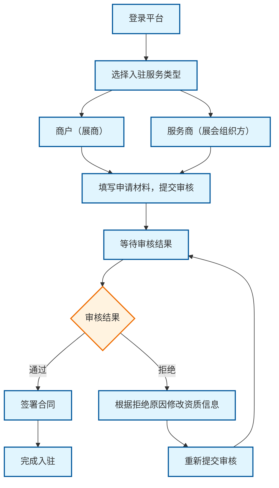
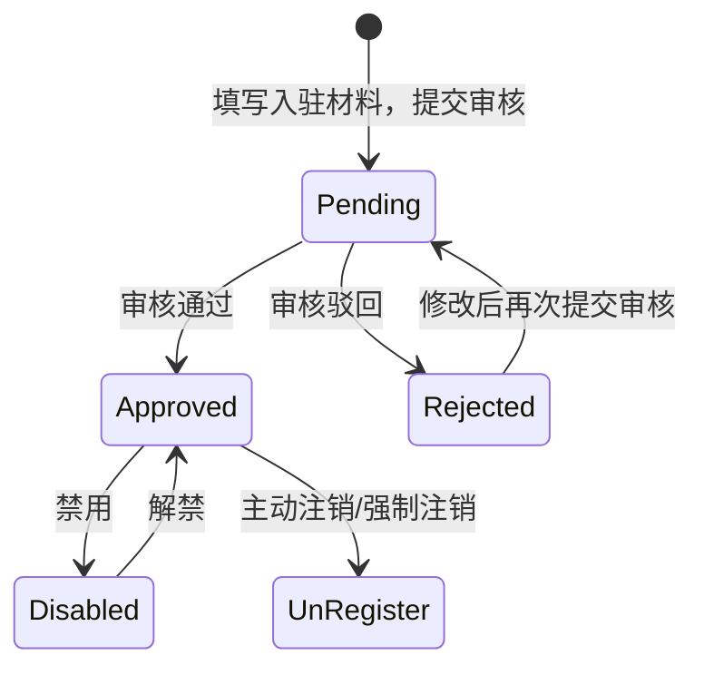
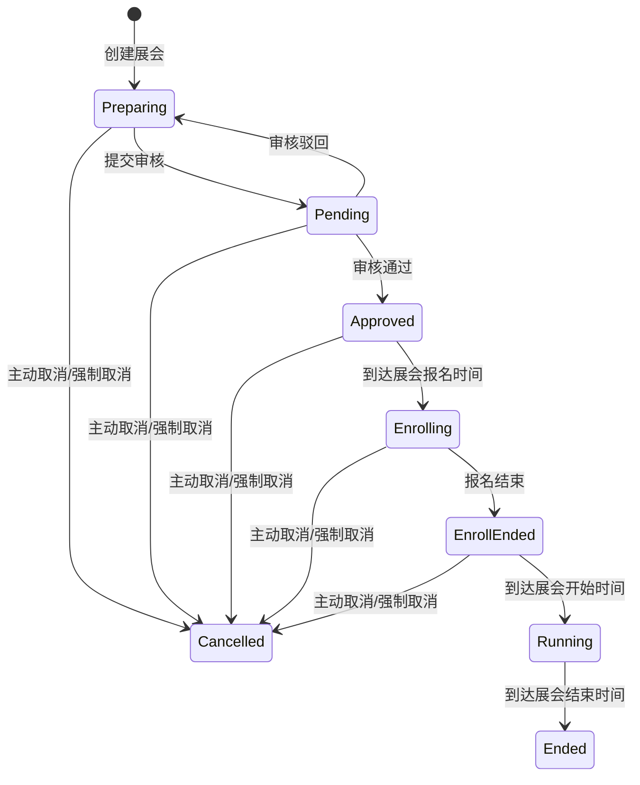

# TODO List
- 入参的参数校验没做，比如长度、格式等。
- Company某些字段，应该是唯一的。
- 系统架构部分，补充服务交互逻辑。最好详细点。
- 加入TaskAsync队列，负责 展示状态切换(审核通过 -> 可预约、可预约 -> 进行中)

# 项目分析
- ExhibitionService 是展会管理平台的核心服务，负责提供所有展会相关的业务功能.
- 包括移动端用户接口和管理后台接口。系统采用微服务架构，与身份认证服务、消息推送服务、文件服务等独立服务进行交互，提供从展会预告到直播互动的完整业务闭环。

## 业务逻辑
- 登录Web后台后，才可选择入驻服务类型。

### 登录逻辑
- 两种登录方式
  - 手机号注册(后续可选择绑定IUQT账户)。
  - 通过IUQT账户一键登录，后台自动创建关联(登录后需要补充手机号信息)。

### 入驻逻辑


## 业务模型
- <span style="color:red">**展会平台(Platform)**</span>
  - 技术平台提供商，也就是展会的承办方。
- <span style="color:red">**公司(Company)**</span>
  - 维护核心资质
    - 营业执照
    - 统一社会信用代码
    - 法人姓名
    - 法人证件号
    - 法人证件照
- <span style="color:red">**服务提供商(ServiceProvider)**</span>
  - 依赖公司主体存在(平台运营规则)
  - 继承公司基础属性 + 服务提供商专属属性

- <span style="color:red">**商户(Merchant)**</span>
  - 依赖公司主体存在(平台运营规则)
  - 继承公司基础属性 + 扩展商户专属属性
  - <span style="color:red">同一个公司，可以创建多个商户身份</span>。但独立运营。

- <span style="color:red">**展会(Exhibition)**</span>


- <span style="color:red">访客</span>
  - 匿名用户（最低权限）
    - 仅能浏览公开展会信息
  - 注册用户（标准权限）
    - 可收藏展会、预约参观。
  - 认证买家（高级权限）
    - 可联系展商、发起采购询盘

# 服务提供商

## 状态流转
- Pending(0): 待审核。
- Approved(1): 审核通过。此时服务商可正常开展业务。
- Rejected(2): 审核驳回。此时服务商可修改资料信息，然后再次提交审核。
- Disabled(3): 禁用。服务商被平台禁用（因违规等），不可开展业务（区别于注销）。
- UnRegisted(4): 注销。服务商主动退出/运营强制退出。


## 数据表设计
```sql
```

## 接口设计
```curl
```

# 商户

## 状态流转
### 状态流转
- Pending(0): 信息已录入，等待平台运营审核。
- Approved(1): 审核通过，此时商户可正常开展业务。
- Rejected(2): 审核驳回，需修改后重新提交审核。
- Disabled(3): 禁用，商户被平台禁用（因违规等），不可开展业务（区别于注销）。
- UnRegisted(4): 注销，商户主动退出，账号永久失效。


## 数据表设计
```sql
```

## 接口设计
```curl

```


# 展会
- 可以由单个服务提供商创建，也可以由多个服务提供商联合创建，也可以有协办商。
- 一个服务提供商可以同时创建多个展会。
- 一个商户可以同时参加多个展会。

## 业务逻辑
### 展会创建
- 创建展会时必须指定所有主办方。

## 状态流转

### 状态定义
- Preparing(0): 筹备中。
  - 展会创建后的初始状态。
  - 进行基础信息配置、展位规划等准备工作。
- Pending(1): 待审核。
  - 等待运营人员审核（退回后可修改）。
  - 期间不可修改展会任何信息。
- Approved(2): 已批准。
  - 通知主办方、协办方，展会创建成功。通过ServiceProviderID推送。
  - 添加定时任务，到了展会开始报名时间，自动流转展会状态。
- Enrolling(3): 报名中。
  - 开放展商申请 和 访客预约。
  - 添加定时任务，到了展会结束报名时间，自动流转展会状态。
- EnrollEnded(4)：报名结束。
  - 展商不可以再报名，但是访客依旧可以预约。
  - 添加定时任务，到了展会开始时间，自动流转展会状态。
- Running(5): 进行中。
  - 展会正式开放，参展商和观众可线上互动。
  - 访客不可以再预约。
  - 通知已参展的展商，展会开始了。
  - 通知已预约的访客，展会开始了。
  - 添加定时任务，到了展会结束时间，自动流转展会状态。
- Ended(6): 已结束。（自动归档数据）
- Cancelled(7): 已取消。
  - 主动终止展会（违规行为、运营调整等）。
  - 需要记录操作者信息，取消原因、取消时间。
  - 通知主办方、协办方、已报名的展商、已预约的访客等展会取消的消息。
  - 取消与该展会相关的所有定时任务（例如，如果是在审核通过后取消，则要取消报名开始的定时任务；如果是在报名中取消，则要取消报名结束和展会开始的定时任务等）。

## 数据表设计
```sql
```


## 接口设计
```curl
POST  /api/v1/exhibition-service/exhibition             # 服务商 -- 创建展会(创建时指定所有主办方)
POST  /api/v1/exhibition-service/exhibition/application # 商户 -- 申请参加展会


